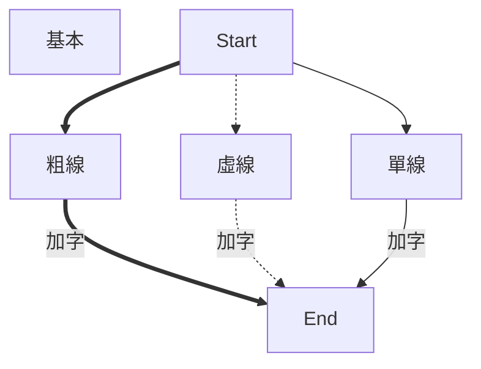
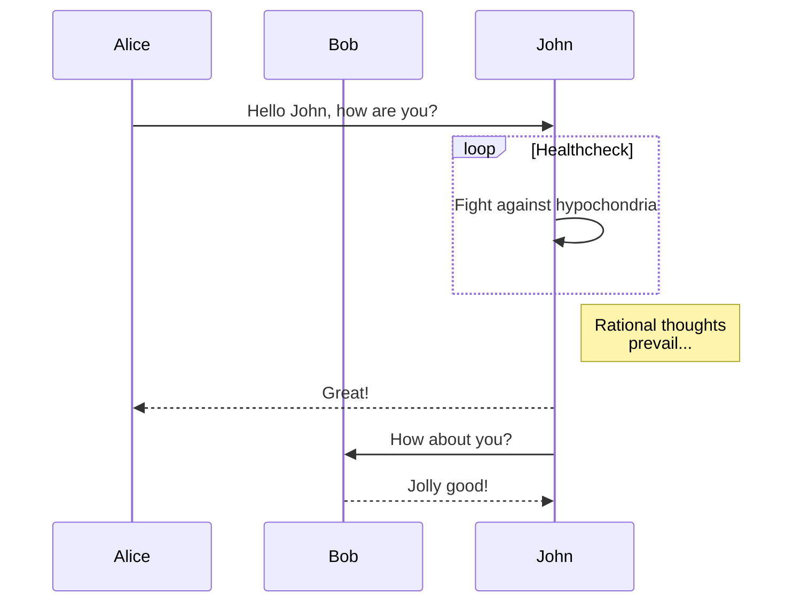
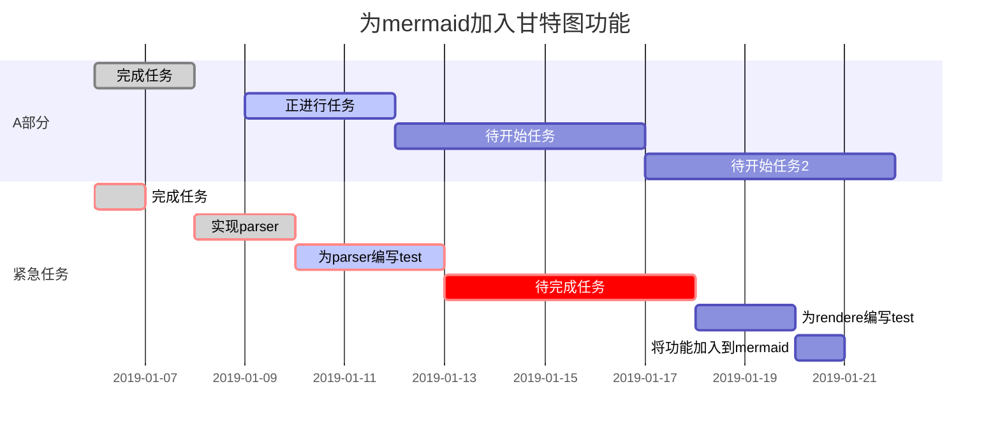
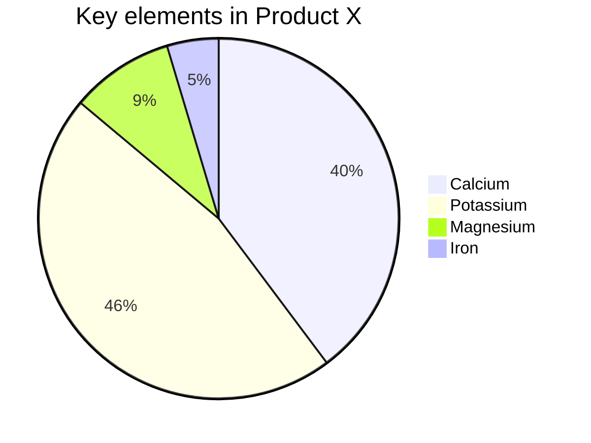
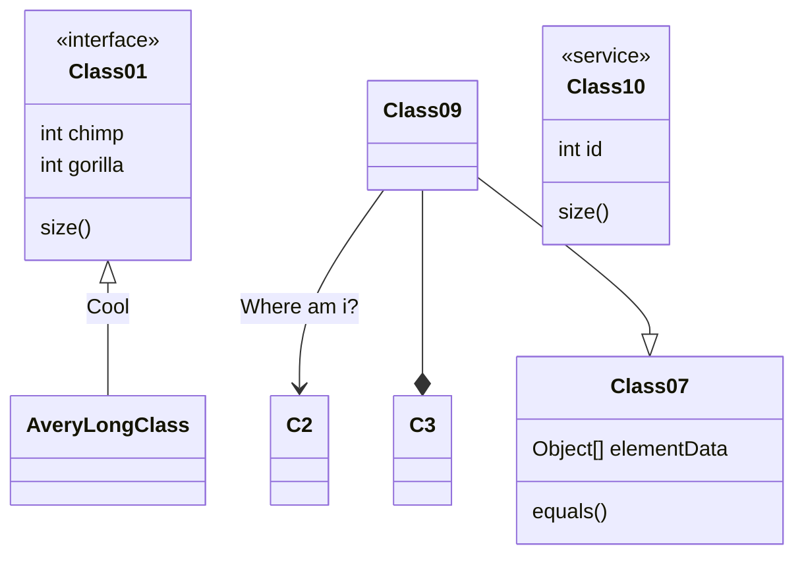
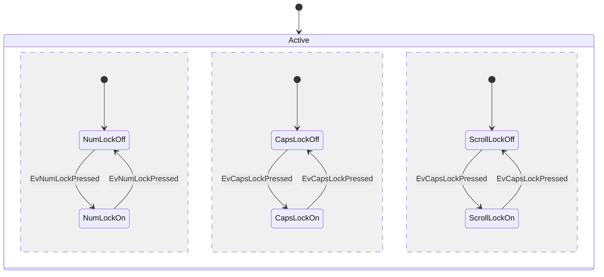
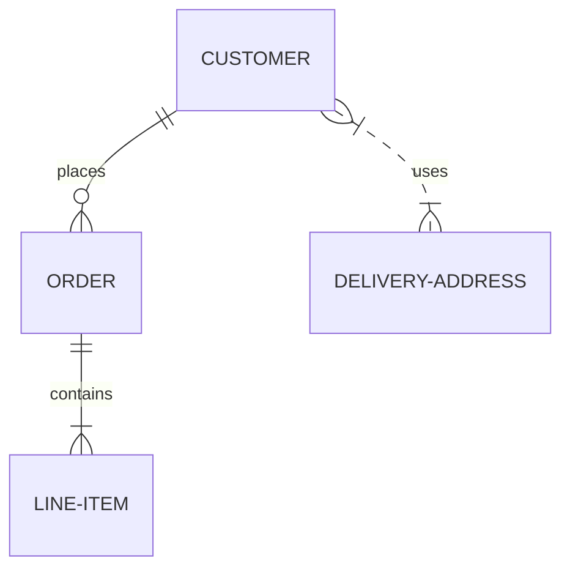

[TOC]

# Install
1. Install Mermaid in VScode
2. F1
3. Open code
4. Mermaid preview

# Sample

## Basic

```mermaid
graph TD;
基本
    Start ==> 粗線 ==加字==> End
	Start -.-> 虛線 -.加字.-> End
    Start -->  單線 --加字--> End
```

## Subgraph

```mermaid
graph LR;
a==>b;
b-->c;
a--联系-->c;
a-->s;
a-.->f;
s-->j;
c---id2;

subgraph 子圖表名;
        id2[默认方形]==粗线==>id3{菱形}
        id3-.虚线.->id4>右向旗帜]
        id3--无箭头---id5((圆形))
		id3-->id6(圓角矩形)
    end
```

## Sequence Diagram

```mermaid
sequenceDiagram
    participant Alice
    participant Bob
    Alice->>John: Hello John, how are you?
    loop Healthcheck
        John->>John: Fight against hypochondria
    end
    Note right of John: Rational thoughts <br/>prevail...
    John-->>Alice: Great!
    John->>Bob: How about you?
    Bob-->>John: Jolly good!
```
## 甘特圖

```mermaid
gantt
    dateFormat  YYYY-MM-DD
    title 为mermaid加入甘特图功能
    section A部分
    完成任务        :done, des1,2019-01-06,2019-01-08
    正进行任务      :active, des2,2019-01-09,3d
    待开始任务      :des3, after des2, 5d
    待开始任务2     :des4, after des3, 5d
    section 紧急任务
    完成任务        :crit,done,2019-01-06,24h
    实现parser     :crit,done,after des1, 2d
    为parser编写test :crit, active, 3d
    待完成任务      :crit,5d
    为rendere编写test: 2d
    将功能加入到mermaid: 1d
```

## 圓餅圖

```mermaid
pie

  title Key elements in Product X
  "Calcium" : 42.96
  "Potassium" : 50.05
  "Magnesium" : 10.01
  "Iron" :  5
```

## 類型圖

```mermaid
classDiagram

  Class01 <|-- AveryLongClass: Cool
  <<interface>> Class01
  Class09-->C2: Where am i?
  Class09 --* C3
  Class09 --|> Class07
  Class07: equals()
  Class07: Object[] elementData
  Class01: size()
  Class01: int chimp
  Class01: int gorilla
  class Class10 {
    <<service>>
    int id
    size()
  }
```

## 狀態圖

```mermaid
stateDiagram

    [*]-->Active
    state Active {
        [*]-->NumLockOff
        NumLockOff-->NumLockOn : EvNumLockPressed
        NumLockOn-->NumLockOff : EvNumLockPressed
        --
        [*]-->CapsLockOff
        CapsLockOff-->CapsLockOn : EvCapsLockPressed
        CapsLockOn-->CapsLockOff : EvCapsLockPressed
        --
        [*]-->ScrollLockOff
        ScrollLockOff-->ScrollLockOn : EvCapsLockPressed
        ScrollLockOn-->ScrollLockOff : EvCapsLockPressed
            }
```

## 實體關係圖

```mermaid
erDiagram
    CUSTOMER ||--o{ ORDER : places
    ORDER ||--|{ LINE-ITEM : contains
    CUSTOMER }|..|{ DELIVERY-ADDRESS : uses
```

