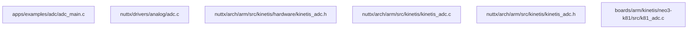

# ADC driver design document


## 目錄結構


## Entry code:
```mermaid

k81_adc_measure-->
```

k81_adc_initialize

# How to porting:
boards/arm/kinetis/neo3-k81/configs/vp3350evt/defconfig
boards/arm/kinetis/neo3-k81/include/board_vp3350.h

